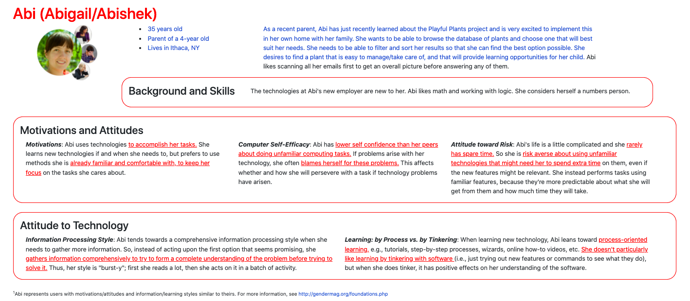
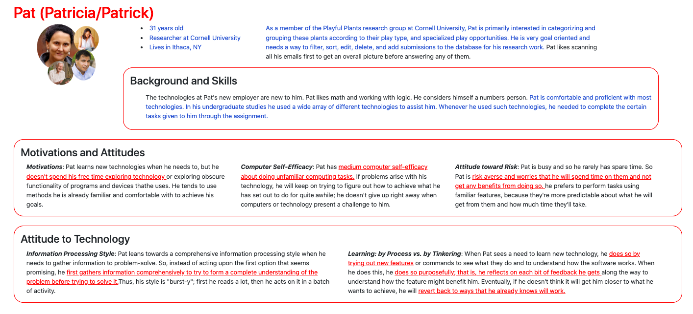
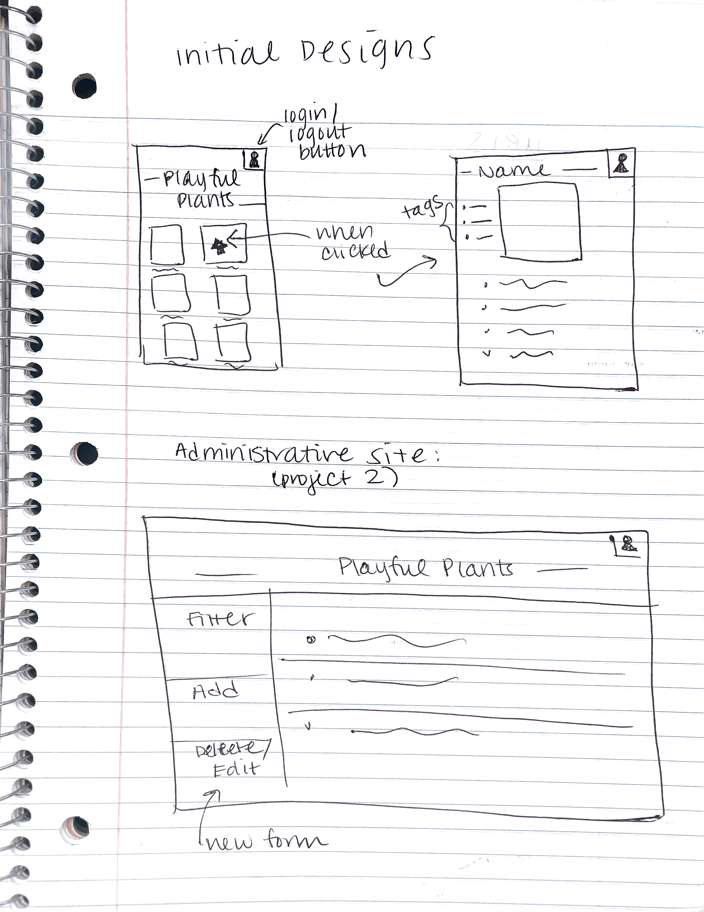
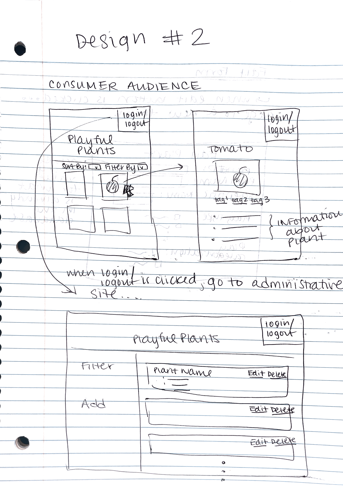
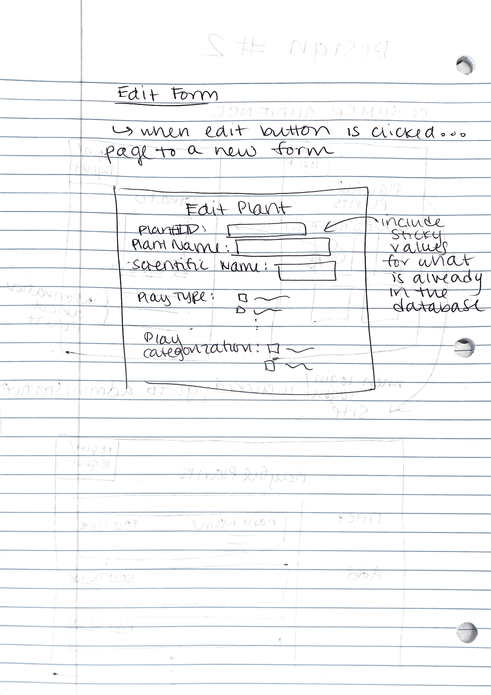
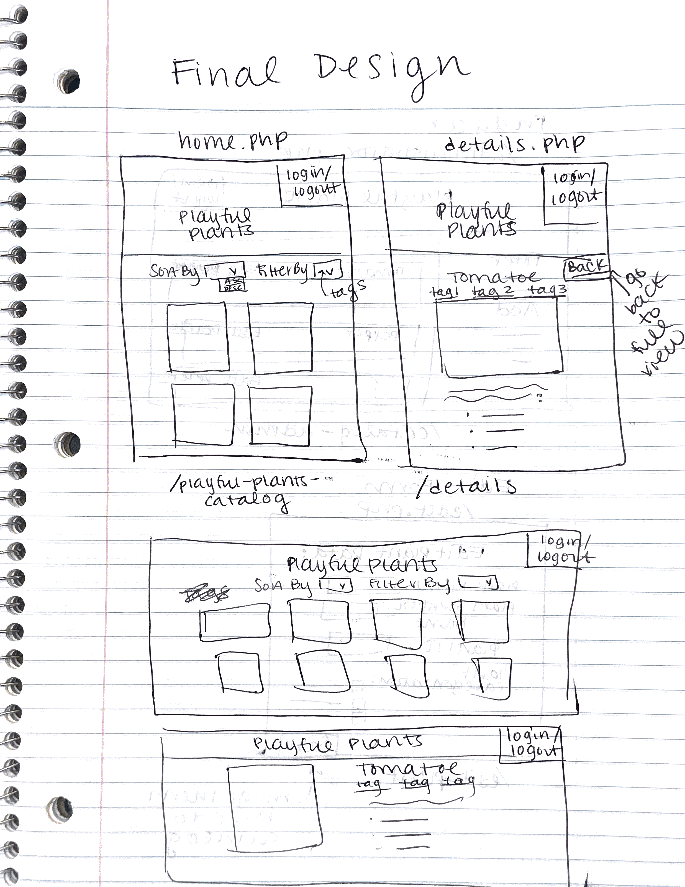
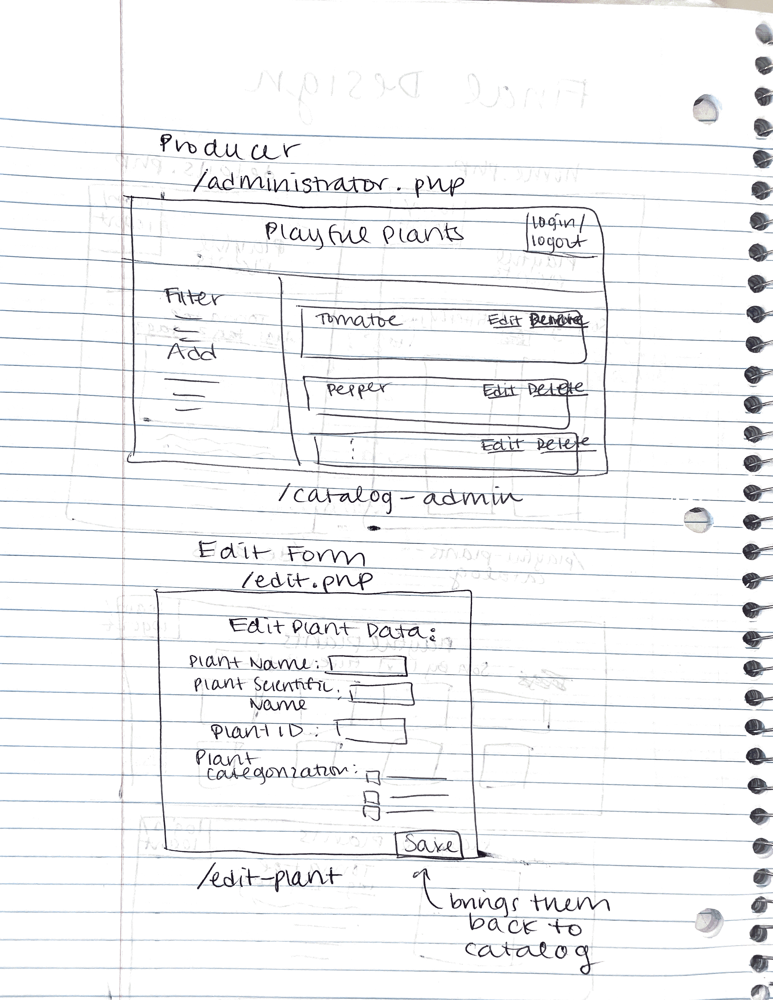
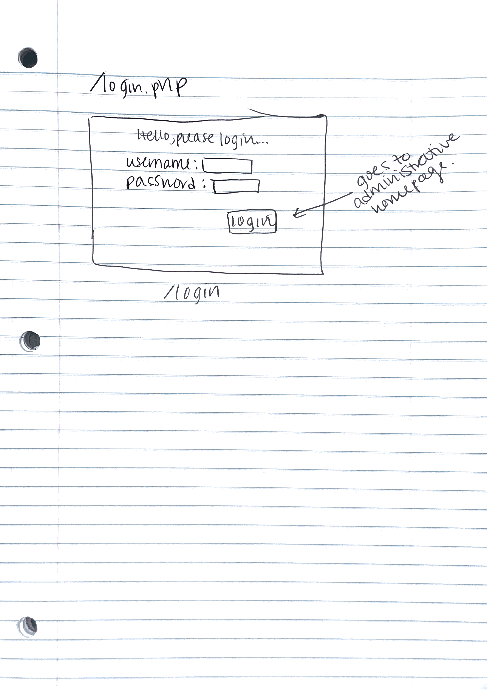
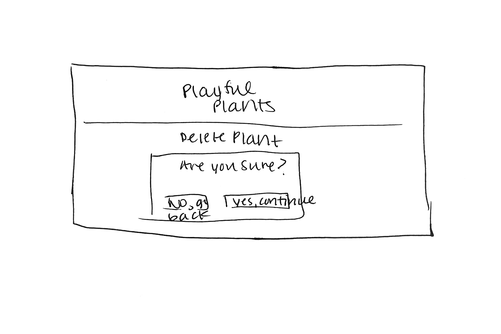

# Project 2: Design Journey

**For each milestone, complete only the sections that are labeled with that milestone.** Refine all sections before the final submission. If you later need to update your plan, **do not delete the original plan, leave it place and append your new plan below the original.** Explain why you are changing your plan. Remember you are graded on your design process. Updating the plan documents your process!

**Replace ALL _TODOs_ with your work.** (There should be no TODOs in the final submission.)

Be clear and concise in your writing. Bullets points are encouraged.

**Everything, including images, must be visible in Markdown Preview.** If it's not visible in Markdown Preview, then we won't grade it. We won't give you partial credit either. **Your design journey should be easy to read for the grader; in Markdown Preview the question _and_ answer should have a blank line between them.**


## Design / Plan (Milestone 1)

**Make the case for your decisions using concepts from class, as well as other design principles, theories, examples, and cases from outside of class (includes the design prerequisite for this course).**

You can use bullet points and lists, or full paragraphs, or a combo, whichever is appropriate. The writing should be solid draft quality.

### Audiences (Milestone 1)

> Who are your site's audiences?
> Briefly explain who the intended audiences are for your project website.
> **DO NOT INVENT RANDOM AUDIENCES HERE!** Use the audiences from the requirements.

_Consumer_: The consumer audience is parents with developing children. These parents are primarily interested in integrating nature-rich spaces into their environmens in order to engage their children.

_Site Administrator_: The site administrator audience is members of the Playful Plants project. These are researchers that would like to develop a database of these plants that can be easily sorted and filtered by specific categories.

### _Consumer_ Audience Goals (Milestone 1)

> Document your audience's goals.
> List each goal below. There is no specific number of goals required for this, but you need enough to do the job.
> **DO NOT INVENT RANDOM GOALS HERE OR STEREOTYPE HERE!** Your goals are things that your users want accomplish when using the site (e.g. print a list of plants). These are informed by the Playful Plants objectives. Review the assignment's requirements for details.

_Consumer_ Goal 1: To browse a database of plants for garden inspiration

- **Design Ideas and Choices** _How will you meet those goals in your design?_
  - create a gallery (similar to online shopping sites) that displays each plant, its picture and some other preliminary information
  - when user clicks on each picture, more information about each plant will be displayed
- **Rationale & Additional Notes** _Justify your decisions; additional notes._
  - these users want to see all of the plants that are available to one, as well as get more detailed information about the ones that catch their eye

_Consumer_ Goal 2: to access the site with a mobile device

- **Design Ideas and Choices** _How will you meet those goals in your design?_
  - make the webpage responsive so that it can be accessed by both a laptop and mobile device
  - make sure that the images are appropiately sized and the page is compatible for mobile device viewing
- **Rationale & Additional Notes** _Justify your decisions; additional notes._
  - users will likely access the website on their phone rather than laptop as they are not performing any administrative duties

_Consumer_ Goal 3: to filter plants by tags, certain types, as well as sort them

- **Design Ideas and Choices** _How will you meet those goals in your design?_
  - have certain filtering options on the page for the consumers
  - have a way to filter by tag
- **Rationale & Additional Notes** _Justify your decisions; additional notes._
  - these users will browse the entire database, but may actually want to narrow down their scope according to certain factors (for example, if they wanted to just look at tomato plants)
  - they will also want to sort the results that they find

### _Consumer_ Persona (Milestone 1)

> Use the goals you identified above to develop a persona of your site's audience.
> Create your persona using GenderMag's customizable personas.
> Take a screenshot and include it here. Persona must be visible in Markdown Preview; do not use PDF format!



### _Administrator_ Audience Goals (Milestone 1)

> Document your audience's goals.
> List each goal below. There is no specific number of goals required for this, but you need enough to do the job.
> **DO NOT INVENT RANDOM GOALS HERE OR STEREOTYPE HERE!** Your goals are things that your users want accomplish when using the site (e.g. print a list of plants). These are informed by the Playful Plants objectives. Review the assignment's requirements for details.

_Administrator_ Goal 1: To browse a database of playful plants

- **Design Ideas and Choices** _How will you meet those goals in your design?_
  - create a website backed by a database in order to display the data
  - use a table to easily display characteristics of each plant
- **Rationale & Additional Notes** _Justify your decisions; additional notes._
  - users wish to see the most important information pertaining to each plant in the database

_Administrator_ Goal 2: to filter the data in order to generate new ideas for nature-themed play

- **Design Ideas and Choices** _How will you meet those goals in your design?_
  - incorporate filtering of the data in a sidebar, or somewhere else on the page
  - display these filtered results to the user
- **Rationale & Additional Notes** _Justify your decisions; additional notes._
  - users need to be able to narrow down the data set

_Administrator_ Goal 3: to share data with others

- **Design Ideas and Choices** _How will you meet those goals in your design?_
  - provide a printer friendly version of the page that can be print out and shared with others
  - create a consistent and easy to follow design that meets the eye well
- **Rationale & Additional Notes** _Justify your decisions; additional notes._
  - users want to share information with others about the playful plant project

_Administrator_ Goal 4: to edit, delete, and add new entries to the database (including uploading photos for the plants)

- **Design Ideas and Choices** _How will you meet those goals in your design?_
  - provide a form/buttons where the administrator can edit certain entries, delete certain entries, as well as add new data to the exisiting plants
  - have the administator login before they can make such changes
- **Rationale & Additional Notes** _Justify your decisions; additional notes._
  - these users need to be able to run the database and make sure the information is accurate for both themselves and the consumer audience

### _Administrator_ Persona (Milestone 1)

> Use the goals you identified above to develop a persona of your site's audience.
> Create your persona using GenderMag's customizable personas.
> Take a screenshot and include it here. Persona must be visible in Markdown Preview; do not use PDF format!




### Site Design (Milestone 1)

> Document your _entire_ design process. **We want to see iteration!**
> **Show us the evolution of your design from your first idea (sketch) to the final design you plan to implement (sketch).**
> **Show us how you decided what data to display to each audience.**
> **Plan your URLs for the site.**
> **Provide a brief explanation _underneath_ each design artifact (2-3 sentences).** Explain what the artifact is, how it meets the goals of your personas (**refer to your personas by name**).
>
> **Important!** Plan _all_ site requirements. Don't forget login and logout.

_Initial Designs / Design Iterations:_

_Design Iteration 1_:



For the initial design, I was mostly concerned with exisiting media catalog design patterns. I decided that for the mobile version of the consumer page, I wanted to have a gallery for the different plants, with two pictures per row for the mobile screen size. I placed an icon in the upper right hand corner that represented the login/logout functionality. When a user clicks on an image on the gallery, it will take you to another page that offers more details about the plant. For the adminstrative site, I reused my previous project 2 designs, and added another form on the bottom for deleting and editing entries, which is another added functionality for this project.

URLS:

- /home.php --> /plant-catalog-admin
- (when user clicks on a certain image page) /details.php --> /details
- (home page for consumers) /catalog.php --> /playful-plants

Data to include in details page for each plant:

- plant name (colloquial)
- edible
- taste
- produces scent
- scent description
- growing needs & characteristics
- general classification

I decided to include just this data, as the consumer audience (parents of developing children) are primarily interested in the name of the plants, how they should take care of it, and other defining characterstics. They aren't so much as concerned with the different characterizations as the administrative audience is.

_Design Iteration 2_:




For my second design iteration, I decided to make the "login/logout" feature explicit instead of just including an icon that could be ambiguous for some users. In addition, I added a sort by and filter by drop down menu before the gallery of images in order to support this functionality for the users. When the user clicks on login/logout, it will lead them to a login page (to be implemented in later milestones) and then to the administrative page. When the administrator then logs out again, it will take them back to the homepage for consumers.

For the details page, I made sure to add the "tags" underneath the picture of each specific plant. I then included the details information underneath in the form of bullets.

For the administrative page, I decided to include the edit/delete functionality in each row for every single plant. This employs common design patterns and also removes the need for another form on the left hand side, which may make the page too busy and confusing for the users. When the user hits the edit button, it will take them to another page with a form that they can edit. This form will contain sticky values for the plant's current values, and then allow the user to edit them further.

URLS:

- (consumer catalog page)/home.php --> /playful-plants-catalog
- (when user clicks on a certain image page) /details.php --> /plant-details
- (home page for producers) /administrator.php --> /catalog-admin

I decided to switch up the URLs a bit for the second design iteration. I realized that with these new set of designs, the consumer catalog homepage is esentially the "initial state" of my webpage. Thus, I renamed this page /home.php and its URL as /playful-plants-catalog. For the details page for the different plants, I kept this URL as /details. Lastly, for the producers homepage, I changed the php file to /administrator.php (since it was previously home) and the URL to /catalog-admin.

I kept the data to include for consumers as the same as iteration 1, as I believe this still encompasses all of the information that they may need.

_Final Design:_





For the final design iteration, I wanted to fully flesh out my filtering, sorting, and functionality of the website. For the consumer catalog, I decided to implement sorting in alphabetical order (both ascending and descending order) using a drop down menu. For filtering, I decided to implement a drop down menu with filtering by each tag. I decided that the tags would be displayed directly underneath the name of each plant before displaying the photo. The rest of the plant details would be displayed in bulleted form underneath the photo. I also included a "back" button in the upper right hand corner that would send the user back to the gallery view of all of the plants. I also decided to include some desktop sketches, since I wanted this part of the website to be responsive. The desktop version is very similar to the mobile version, except for the fact that the elements can now take more horizontal space.

For the administrative home view, I kept the design the same. The edit form also remained the smae since my last iteration. I also remembered to include a 'save' submit  button since I forgot to include that in my last sketch. I also included a sketch for my login page. This will simply have a field for the username and password, and then a submit button. Once the user hits submit, it will take them to the administrative home page.

URL Table:

| Route | PHP File                            |
| ----- | ----------------------------------- |
| /playful-plants-catalog | pages/home.php |
| /details | pages/details.php |
| /catalog-admin  | pages/administrator.php |
| /edit-plant  | pages/edit.php   |
| /login  | pages/login.php   |


Once again, I kept the data to include for the consumer home page as the following:

- plant name (colloquial)
- edible
- taste
- produces scent
- scent description
- growing needs & characteristics
- general classification

_Design Edits:_

When implementing the delete functionality, I decided to include a delete page as well so that the user can confirm deleting an entry when they hit the delete link instead of directly deleting it without any sort of confirmation. The design for my delete page is as follows:




### Design Pattern Explanation/Reflection (Milestone 1)

> Write a one paragraph (6-8 sentences) reflection explaining how you used design patterns for media catalogs in your site's final design.

I followed many of the common design patterns for media catalogs by drawing from the seed website as inspiration. Many catalogs have gallerys of images with titles underneath. They also have some sort of filtering or sorting implemented along the left hand side (for desktop versions) and on top of the page for mobile. In addition, many catalogs implement the design pattern that when the user clicks on a certain image, a more detailed page will come up in regards to that specific plant. I have used both of these familiar patterns in my design. Also, I have implemented the common web designs of editing and removing entries in a database. I played the edit/delete actions in every single row all the way to the right hand side. This is a common design pattern.


### Cognitive Styles Explanation/Reflection (Milestone 1)

> Write a one paragraph (6-8 sentences) reflection explaining how your final design supports the cognitive styles of each persona.

_Consumer Cognitive Styles Reflection:_

Abi uses technology to accomplish her tasks, and also has a lower self confidence when it comes to using technology. Thus, my design strives to be as simply as possible in terms of ofering her that easy way to interact with the design. I implemented common design patterns that will be familiar toward her, as well as drop down menus for filtering and sorting that easily display all of the different options. Moreover, since she likes to have a comprehensive view of the information, the default state of the design shows all of the plants at once. The cursor will change to a hand when you hover over an image, to indicate that you may click on it. This is another way in which Abi does not have to take any risks, and knows exactly what to do.

_Site Administrator Cognitive Styles Reflection:_

Since Pat has a pretty high confidence in his abilities, the site for the producer audience is a bit more complicated. The forms are on the left side of the page, the catalog on the right, as well as edit/delete buttons present. Since he has high computer proficiency, there are a lot of different ways to interact with the site. However, Pat will learn these functionalities by being very goal oriented in accomplishing certain tasks. He will logically think through the different tasks and how they can be accomplished by the site. The filtering an sorting supports this cognitive style since he is able to filter and sort in multiple different ways and combinations in order to see the results.


## Implementation Plan (Milestone 1, Milestone 2, Milestone 3, Final Submission)

### Database Schema (Milestone 1)
> Describe the structure of your database. You may use words or a picture. A bulleted list is probably the simplest way to do this. Make sure you include constraints for each field.
> **Hint: You probably need a table for "entries", `tags`, `"entry"_tags`** (stores relationship between entries and tags), and a `users` tables.
> **Hint: For foreign keys, use the singular name of the table + _id.** For example: `image_id` and `tag_id` for the `image_tags` (tags for each image) table.

Table: plants

- id: INTEGER {NN,PK,U,AI}
- plant_name_colloquial: TEXT {NN}
- plant_name_scientific: TEXT {NN}
- plantID: TEXT {NN,U}
- constructive_play: INTEGER {NN} (either 0 or 1)
- sensory_play: INTEGER {NN} (either 0 or 1)
- physical_play: INTEGER {NN} (either 0 or 1)
- imaginative_play: INTEGER {NN} (either 0 or 1)
- restorative_play: INTEGER {NN} (either 0 or 1)
- expressive_play: INTEGER {NN} (either 0 or 1)
- play_with_rules: INTEGER {NN} (either 0 or 1)
- bio_play: INTEGER {NN} (either 0 or 1)
- nooks_or_secret_spaces: INTEGER {NN} (either 0 or 1)
- loose_parts_or_play_props: INTEGER {NN} (either 0 or 1)
- climbing_and_swinging: INTEGER {NN} (either 0 or 1)
- mazes: INTEGER {NN} (either 0 or 1)
- unique_elements: INTEGER {NN} (either 0 or 1)
- edible: INTEGER {NN} (either 0 or 1)
- taste: TEXT
- produces_scent: INTEGER {NN} (either 0 or 1)
- scent: TEXT
- perennial: INTEGER{NN} (either 0 or 1)
- annual: INTEGER{NN} (either 0 or 1)
- full_sun: INTEGER{NN} (either 0 or 1)
- partial_shade: INTEGER{NN} (either 0 or 1)
- full_shade: INTEGER{NN} (either 0 or 1)
- hardiness_zone_range: TEXT
- general_classification: TEXT {NN}
- photo_file_extension: TEXT

Table: tags

- id: INTEGER {NN,PK,U,AI}
- tag: TEXT {NN,U}

Table: plant_tags

- id: INTEGER {NN,PK,U,AI}
- plant_id: INTEGER {NN,U} (foreign key)
- tag_id: INTEGER {NN,U} (foreign key)

Table: users

- id: INTEGER {NN,PK,U,AI}
- name: TEXT {NN}
- username: TEXT {NN,U}
- password; TEXT {NN}

Table: sessions

- id: INTEGER {NN,PK,U,AI}
- user_id: INTEGER {NN} (foreign key)
- session: TEXT {NN,U}
- last_login: TEXT {NN,U}

Table: groups

- id: INTEGER {NN,PK,U,AI}
- name: TEXT {NN,U}

Table: memberships

- id: INTEGER {NN,PK,U,AI}
- group_id: INTEGER {NN} (foreign key)
- user_id: INTEGER {NN} (foreign key)


### Database Query Plan (Milestone 1, Milestone 2, Milestone 3, Final Submission)
> Plan _all_ of your database queries. You may use natural language, pseudocode, or SQL.

For consumer home page...
```
SELECT plant_name_colloquial, plantID, photo_file_extension FROM plants
```

For administrator page...
```
SELECT * FROM plants
```

For any sort of filtering...
```
SELECT ... FROM plants WHERE (conditions from filtering)
```

For edit/delete page...
```
SELECT plant_name_colloquial (or * for edit page) FROM plants WHERE (id = id of query string parameter)
```

For details page...
```
SELECT plant_name_colloquial, plant_name_scientific, edible, taste, produces_scent, scent, perennial, annual, full_sun, partial_shade, full_shade, hardiness_zone_range, general_classification, photo_file_extension FROM plant WHERE (plantID = plantid of query string parameter)
```

For retrieiving tags...
```
SELECT tags.tag AS 'tags'  FROM plant_tags
INNER JOIN tags
ON (plant_tags.tag_id = tags.id)
WHERE (plant_id = current id ofthe plant on the details page)
```

### Code Planning (Milestone 1, Milestone 2, Milestone 3, Final Submission)
> Plan any PHP code you'll need here using pseudocode.
> Tip: Break this up by pages. It makes it easier to plan.

/home.php (consumer home page):
```
if login/logout clicked:
  go to login page
if sort by/filtering applied:
  query the database according to the specific sort or filter
if user clicks on an image:
  send them to the details page for that specific plant (use "a" element with hidden input)
if user enters URL with unknown plantid:
  show message that plant does not exist

```

/details.php (details page for plants):
```
if login/logout clicked:
  go to login page
if user hits back button:
  go back to the main gallery
if user clicks on one of the tags underneath the plant:
  filter main gallery page by this tag
if user enters URL with unknown plantid:
  show message that plant does not exist
```

/administrator.php (administrator home page)
```
if user is logged in AND an admin:
  initialize all default state variables (parameters/sticky values to empty string, feedback class to hidden)
  initialize sql select clause
  if add form is submitted:
    get data from HTPP request
    set form valid to true
    if any of the required fields are empty:
      set form valid to false
      show corrective feedback
    if form is invalid
      set sticky values
    if form is valid
      insert the data into the database
      show confirmation that the user added plant to database successfully

  if filter form is submitted:
    set sticky values for the filtering criteria (so that if they reload the page it will stay on that filter)
    filter by the appriopiate criteria (using string concatenation and where clause)
    show confirmation that the user is filtering by the certain fields

  if sorting form is submitted:
    sort the items from the database accordingly
    set sticky values so the page continues to be sorted that way

  if edit link is clicked:
    send the user to the edit form page (send id of plant through query string parameter)

  if delete link is clicked:
    send user to the delete page (send id of plant through query string parameter)
if not logged in:
  show a link to the login page
if not an admin:
  display message that they do not have access to this site. Show link to consumer homepage

```

/edit.php (edit form for plants)
```
if user is logged in AND an admin of the site:
  initialize all sticky parameters in the edit form (so user knows what was there before)
  if edit form is submitted:
    edit database to reflect the changes the user has made
    show confirmation of a successful edit, show link to go back to catalog
  if user enters URL with unknown plantid:
    show message that plant does not exist
if not logged in:
  show a link to the login page
if not an admin:
  display message that they do not have access to this site. Show link to consumer homepage

```

/login.php (login form)
```
if user hits login submit:
  verify their crudentials
  send them to the admin home page
```

/delete.php (delete form)
```
if user is logged in AND an admin of the site:
  Display confirmation (are you sure you want to delete the plant?)
  if user hits go back:
    send back to catalog
  if user hits yes continue:
    delete record from database
    show confirmation of deletion
    include link to go back to catalog
if not logged in:
  show a link to the login page
if not an admin:
  display message that they do not have access to this site. Show link to consumer homepage
```


### Accessibility Audit (Final Submission)
> Tell us what issues you discovered during your accessibility audit.
> What do you do to improve the accessibility of your site?

During my accesibility audit, I found that I was missing alternative text attributes for all of the images on my catalog site. I decided to fix this by echoing out the name of the plant in the alt attribute for each image. Other than this issue, I did not have any other accessibiility issues from my WAVE audit.


## Reflection (Final Submission)

### Audience (Final Submission)
> Tell us how your final site meets the goals of your audiences. Be specific here. Tell us how you tailored your design, content, etc. to make your website usable for your personas.

My final site design definitely meets the goals of my audience. The consumer audience, modeled by the persona Abi, is for parents with developing children who wish to implement playful plants in their own life. Abi does not have much time on her free hands, so the site employs common design patterns and easy to use frameworks so that she does not need to waste her time. In addition, the content is tailored to the user as they mostly care about the needs for taking care of the plants, and the type of plant it is. I also included imaging as part of the common design pattern of a gallery. Abi is also able to sort and filter through the plants so that she can pick whatever she wants. The details page also allows Abi to browse more specific details about each plant should she be interested. The administrative portions of the site are off-limit to the consumer audience, Abi. However, there is a message that is generated if she accidentally clicks somewhere so that she will not blame herself for messing up the website.

In terms of the producer audience, my site is also well tailored to this audience, modeled by the persona Pat. Pat is a researcher at Cornell University with the Playful Plants project. Although he is very good with technology, he often uses it with goal-oriented tasks. Thus, Pat must be able to accomplish what he wants to do efficiently. To this end, the administrative portion of the site has clear edit, delete, add, and filter forms. The site utilizes the common design patterns of filtering on the left hand side with all of the content in a table like manner on the main right hand side. Also, there is a delete, edit, and add confirmation so that Pat is sure he has accomplished his task.


### Additional Design Justifications (Final Submission)
> If you feel like you haven’t fully explained your design choices in the final submission, or you want to explain some functions in your site (e.g., if you feel like you make a special design choice which might not meet the final requirement), you can use the additional design justifications to justify your design choices. Remember, this is place for you to justify your design choices which you haven’t covered in the design journey. You don’t need to fill out this section if you think all design choices have been well explained in the design journey.


### Self-Reflection (Final Submission)
> Reflect on what you learned during this assignment. How have you improved from Project 2? What would you do differently next time?

I have definitely improved from Project 2. I feel like in project 2 I did not fully understand the way that sorting and filtering worked on my webpage. Also, I definitely did not have a good handle on a POST vs a GET request. However, with this project, I was able to distinguish between the two very easily and I also had a much better sense of the way the PHP code worked and the logic behind it. Next time, I would improve my pseudocode a bit more. I think the pseudocode I wrote in the beginning was a little bit too general and was harder to implement. When I got to the user access controls, I made sure to make this pseucode plan very detailed, and it was much easier to implement these conditional statements.


> Take some time here to reflect on how much you've learned since you started this class. It's often easy to ignore our own progress. Take a moment and think about your accomplishments in this class. Hopefully you'll recognize that you've accomplished a lot and that you should be very proud of those accomplishments!

I am definitely amazed by the progress in my class. The webpage design has come a long way since the simple HTML/CSS in 1300 and it is amazing the website that I was able to produce for this project! I think that I can definitely take all of the tools that I have learned from this class and apply it to web frameworks in order to design even more advanced webpages.


### Grading: Step-by-Step Instructions (Final Submission)
> Write step-by-step instructions for the graders.
> The project if very hard to grade if we don't understand how your site works.
> For example, you must login before you can delete.
> For each set of instructions, assume the grader is starting from /

_View all entries:_

1. For the consumer, all of the entries are loaded on the / page immediately in a photo gallery format.
2. For the producer, you must login via the login button on the upper right hand corner of the screen. Once you are logged in with a user that is part of the admin group (user ikb22), you will be able to see all of the entries on the /catalog-admin page. This is the homepage for administrators (producer) audience.

_View all entries for a tag:_

1. When you are on the / page, you can filter by the certain tags using the filter drop down menu. (you can also sort alphabetically).
2. If you navigate from the / page and click on a name of a plant, it will redirect you to the details page for that plant. If you click on any of the tags underneath the photo for that plant, it will redirect you to the / page with filtering for that specific tag you just clicked.

_View a single entry's details:_

1. In order to view a single entry's details, you simply click on the name of the specific plant that you want to see (these names appear above the photos)

_How to insert and upload a new entry:_

1. First, you must login with a user that is part of the admin group (if you are not already). Otherwise, you will not have access to the page.
2. Once logged in with admin crudentials, you can navigate to /catalog-admin. Then, on the left hand side of the screen, there is an add form. Fill this out with the necessary information, and hit the add plant button.
3. If successful, a confirmation message should display.

_How to delete an entry:_

1. Once again, you must be logged in with admin crudentials in order to perform this task.
2. Once you are logged in with the correct crudentials, there is a "delete" link (underlined) on the upper right hand corner of every single row in the table.
3. Click the delete link, and you will be directed to /delete. Now a confirmation message should appear asking if you are sure. You can either go back or hit yes continue.
4. If you hit yes, continue, then another confirmation message should appear that the deletion was successful.

_How to edit and existing entry and its tags:_

1. You must be logged in as part of the admin group to have access to this task.
2. Right next to the delete button, there is also an edit button (also underlined).
3. Click this link, and it will direct you to the /edit-plant page.
4. This page includes a form very similar to the add form. It should already be filled out with the plant's current information from the database. Make any edits that you please.
5. When done editing, hit the edit plant button, and a confirmation should appear that the edit was successful.


Note: For some reason, when I was testing my file uploads, it seems like you have to press the edit/add button twice in order for the request to go through. If you only click it once, the page will just load contually and nothing will happen. I tried to debug the file uploads code extensively but I couldn't find anything that was wrong. So, in order to upload a file for the add or edit form, you have to press the button twice if it does not go through the first time and then the upload will get moved to the proper directory and it shows up on the gallery homepage /.
